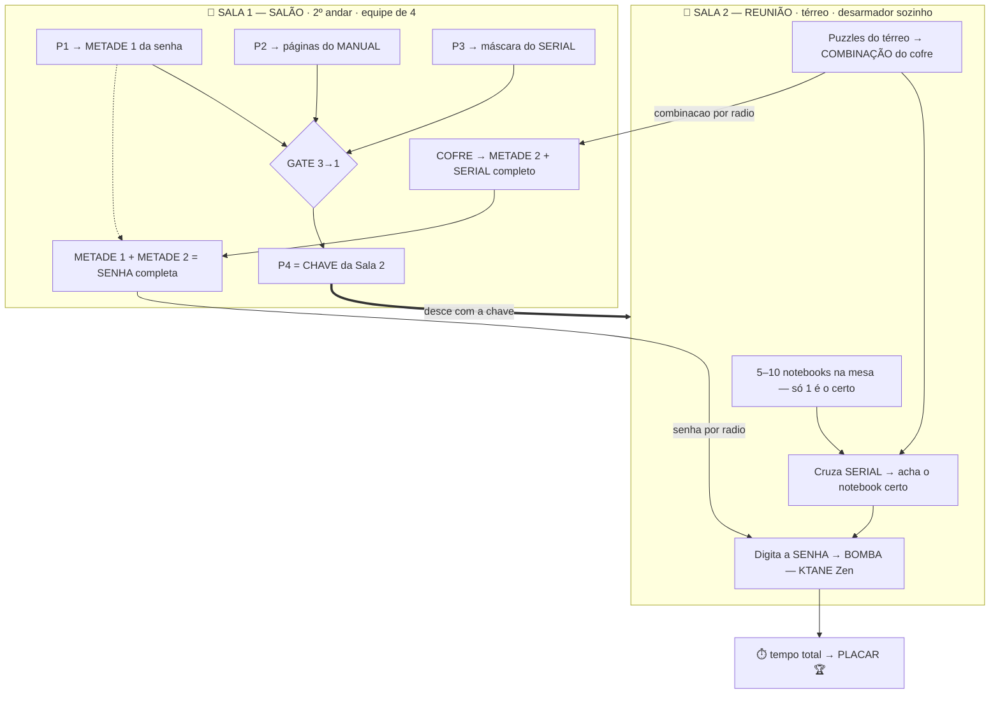

# 🔓 Escape Room IATEC — "Código Vermelho"

Escape room corporativo com clímax em **Keep Talking and Nobody Explodes (KTANE)** no modo
**Zen**, dividido em **dois andares** e movido por **comunicação por rádio**.

## Visão geral

| Item | Definição |
|---|---|
| **Salas** | **Sala 1** = salão grande (2º andar) · **Sala 2** = sala de reunião p/ 4 (térreo) |
| **Equipe** | 5 pessoas: **4 no salão** + **1 desarmador sozinho** no térreo |
| **Comunicação** | 100% por **rádio** (andares diferentes) |
| **Público** | Diverso, maioria nunca jogou escape room / KTANE |
| **Operação** | Roda o dia todo, **uma equipe por vez**, sala **resetada** entre tentativas |
| **Bomba** | KTANE em **modo Zen**: sem explosão, tempo **progressivo**, cada strike **soma tempo** |
| **Objetivo** | **Menor tempo total** → **premiação** no fim do dia 🏆 |
| **Extra** | Cronômetro do jogo espelhado nas **TVs** das duas salas · **plaquinhas de foto** no fim |

## O enredo

> Um ex-colaborador insatisfeito escondeu um **notebook armado** na sala de manutenção do
> térreo, no meio de vários outros notebooks idênticos. O sistema está bloqueado por senha.
> A equipe é o esquadrão anti-bombas: **4 pessoas** vasculham o salão do 2º andar em busca
> das pistas, enquanto **1 desarmador** desce ao térreo, sozinho, para achar o notebook
> certo e desarmá-lo. Só conseguem se **falarem pelo rádio**. Vence quem desarma no **menor
> tempo**.

## Por que este design funciona

1. **A arquitetura do prédio vira mecânica.** Desarmador no térreo + equipe no 2º andar =
   o rádio não é opcional, é a **única** ponte. É o espírito do KTANE imposto pelo espaço.
2. **Ninguém tem a senha completa sozinho.** As duas metades ficam no salão, mas a
   **combinação do cofre** (que guarda a metade 2) só vem dos puzzles do térreo → dependência
   nos dois sentidos.
3. **Modo Zen = ninguém sai frustrado.** Sem explosão; a competição é por **tempo**. Ideal
   para novatos e para rodar o dia todo com um **placar**.
4. **4 puzzles paralelos + 2 trilhas anti-ociosidade** mantêm as 4 pessoas do salão ocupadas
   o tempo todo — inclusive na janela em que esperam o desarmador achar a combinação do cofre
   (trilhas **B1** = preparar o manual, **B2** = satélite opcional com bônus de tempo).

## Fluxo em uma imagem

> No GitHub o diagrama acima renderiza como imagem. A **planta física** das salas (posição dos
> objetos) fica em ASCII no [`docs/01-fluxo-e-mapa.md`](docs/01-fluxo-e-mapa.md), que é melhor
> para layout espacial.

## Documentos

| Arquivo | Conteúdo |
|---|---|
| [`docs/01-fluxo-e-mapa.md`](docs/01-fluxo-e-mapa.md) | Mapa dos 2 andares, gate 3→1, papéis, dependências |
| [`docs/02-puzzles.md`](docs/02-puzzles.md) | Cada puzzle com material, montagem e **solução** (só GM) |
| [`docs/03-bomba-ktane.md`](docs/03-bomba-ktane.md) | Config **Zen**, seleção de módulos, TVs, placar |
| [`docs/04-roteiro-game-master.md`](docs/04-roteiro-game-master.md) | Roteiro, dicas por rádio, **reset dos 2 andares**, planilha de tempos |
| [`docs/05-materiais-e-impressao.md`](docs/05-materiais-e-impressao.md) | Materiais, o que imprimir, plaquinhas de foto |

## Materiais que você já tem

Lanterna UV · impressora · transparências · impressora 3D · malas com combinação numérica ·
cofre · notebook(s) · rádios comunicadores · TVs nas duas salas.

---
*Os valores de senha/combinação nos docs são **exemplos prontos** — troque-os antes de operar,
já que este repositório pode ter sido lido por participantes.*
