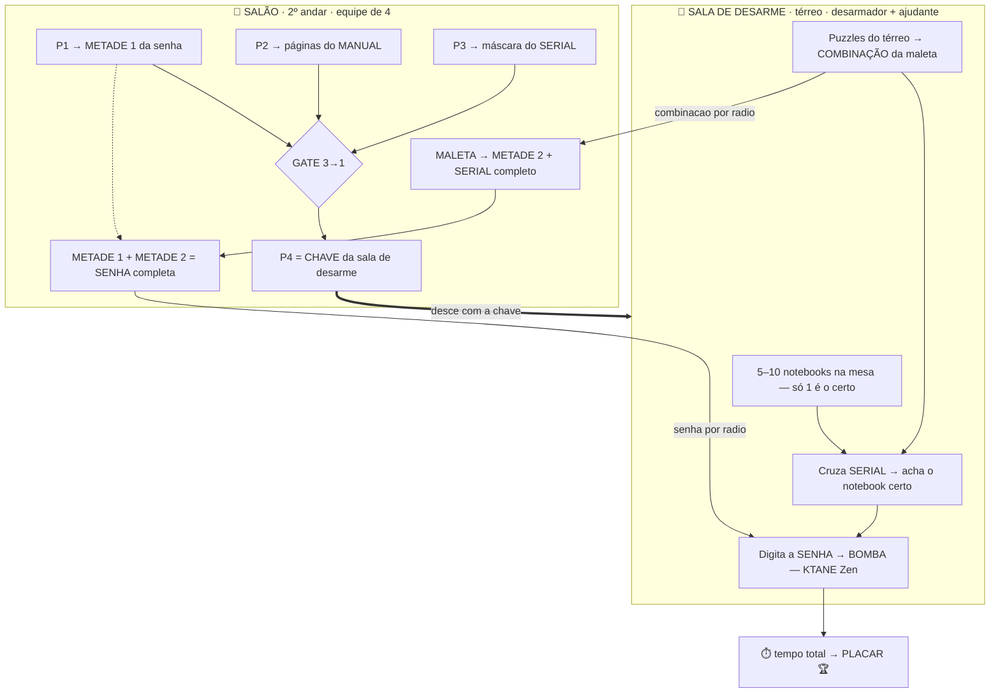

# 🔓 Escape Room IATEC — "Protocolo de Contenção"

> **A ameaça veio de dentro. O tempo está correndo.**

Escape room corporativo com clímax em **Keep Talking and Nobody Explodes (KTANE)** no modo
**Zen**, dividido em **dois andares** e movido por **comunicação por rádio**. O enredo é uma
**resposta a incidente de segurança da informação**: conter (isolar) e desarmar um host
comprometido antes do relógio.

## Visão geral

| Item                | Definição                                                                                                                 |
| ------------------- | ------------------------------------------------------------------------------------------------------------------------- |
| **Salas (por ala)** | **Salão** = sala da equipe (2º andar) · **Sala de desarme** = sala pequena do térreo                                      |
| **Alas**            | **Duas em paralelo** — Ala B (1B + "Calabouço") e Ala C (1C + sala ao lado da sala do pastor)                             |
| **Equipe**          | 6 pessoas: **4 no salão** + **2 na sala de desarme** (desarmador + ajudante)                                              |
| **Comunicação**     | 100% por **rádio** (andares diferentes)                                                                                   |
| **Público**         | Diverso, maioria nunca jogou escape room / KTANE                                                                          |
| **Operação**        | Dia todo (**8:30–16:30**), **duas alas em paralelo**, ciclos de **30 min de jogo + 10 min de reset**, **2 equipes de GM** |
| **Agenda**          | Participantes **se inscrevem e agendam horário**                                                                          |
| **Bomba**           | KTANE em **modo Zen**: sem explosão, tempo **progressivo**, cada strike **soma tempo**                                    |
| **Objetivo**        | **Menor tempo total** → **Premiação 1** no fim do dia 🏆                                                                   |
| **Premiação bônus** | Meta-jogo opcional do **cofre** (Premiação 2), fora do caminho crítico · ver [`docs/07`](docs/07-meta-jogo-cofre.md)      |
| **Extra**           | Cronômetro do jogo espelhado nas **TVs** das duas salas de cada ala · **plaquinhas de foto** no fim                       |

> Operação do dia (datas, alas, escala): ver [`.kiro/steering/evento.md`](.kiro/steering/evento.md).
> Os docs usam termos genéricos **"Salão"** e **"Sala de desarme"**; o mapeamento físico por ala
> (1B/1C, Calabouço/sala do pastor) está no steering.

## O enredo

> Um ex-colaborador insatisfeito escondeu um **notebook armado** na sala de manutenção do
> térreo, no meio de vários outros notebooks idênticos. O sistema está bloqueado por senha.
> A equipe é o esquadrão anti-bombas: **4 pessoas** vasculham o salão do 2º andar em busca
> das pistas, enquanto **2 descem ao térreo** — o **desarmador** e um **ajudante** — para achar
> o notebook certo e desarmá-lo. Só conseguem se **falarem pelo rádio**. Vence quem desarma no
> **menor tempo**.

## Por que este design funciona

1. **A arquitetura do prédio vira mecânica.** Dupla do desarme no térreo + equipe no 2º andar =
   o rádio não é opcional, é a **única** ponte. É o espírito do KTANE imposto pelo espaço.
2. **Ninguém tem a senha completa sozinho.** As duas metades ficam no salão, mas a
   **combinação da maleta de evidências** (que guarda a metade 2) só vem dos puzzles do térreo
   → dependência nos dois sentidos.
3. **Modo Zen = ninguém sai frustrado.** Sem explosão; a competição é por **tempo**. Ideal
   para novatos e para rodar o dia todo com um **placar**.
4. **4 puzzles paralelos + 2 trilhas anti-ociosidade** mantêm as 4 pessoas do salão ocupadas
   o tempo todo — inclusive na janela em que esperam a dupla achar a combinação da maleta
   (trilhas **B1** = preparar o manual, **B2** = satélite opcional com bônus de tempo).

## Fluxo em uma imagem

```mermaid
flowchart TB
    subgraph SALAO["🏢 SALÃO · 2º andar · equipe de 4"]
        P1["P1 → METADE 1 da senha"]
        P2["P2 → páginas do MANUAL"]
        P3["P3 → máscara do SERIAL"]
        GATE{"GATE 3→1"}
        P4["P4 = CHAVE da sala de desarme"]
        MALETA["MALETA → METADE 2 + SERIAL completo"]
        SENHA["METADE 1 + METADE 2 = SENHA completa"]
        P1 --> GATE
        P2 --> GATE
        P3 --> GATE
        GATE --> P4
        MALETA --> SENHA
        P1 -.-> SENHA
    end

    subgraph TERREO["🔻 SALA DE DESARME · térreo · desarmador + ajudante"]
        NOTES["5–10 notebooks na mesa — só 1 é o certo"]
        T1["Puzzles do térreo → COMBINAÇÃO da maleta"]
        ACHA["Cruza SERIAL → acha o notebook certo"]
        BOMBA["Digita a SENHA → BOMBA — KTANE Zen"]
        T1 --> ACHA
        NOTES --> ACHA
        ACHA --> BOMBA
    end

    P4 ==>|desce com a chave| TERREO
    T1 -->|combinacao por radio| MALETA
    SENHA -->|senha por radio| BOMBA
    BOMBA --> PLACAR["⏱️ tempo total → PLACAR 🏆"]
```

> No GitHub o diagrama acima renderiza como imagem. A **planta física** das salas (posição dos
> objetos) fica em ASCII no [`docs/01-fluxo-e-mapa.md`](docs/01-fluxo-e-mapa.md), que é melhor
> para layout espacial. O diagrama vale para **cada ala**; as duas rodam o mesmo fluxo em paralelo.

## Documentos

| Arquivo                                                                | Conteúdo                                                               |
| ---------------------------------------------------------------------- | ---------------------------------------------------------------------- |
| [`docs/01-fluxo-e-mapa.md`](docs/01-fluxo-e-mapa.md)                   | Mapa dos 2 andares, gate 3→1, papéis, dependências                     |
| [`docs/02-puzzles.md`](docs/02-puzzles.md)                             | Cada puzzle com material, montagem e **solução** (só GM)               |
| [`docs/03-bomba-ktane.md`](docs/03-bomba-ktane.md)                     | Config **Zen**, seleção de módulos, TVs, placar                        |
| [`docs/04-roteiro-game-master.md`](docs/04-roteiro-game-master.md)     | Roteiro, dicas por rádio, **reset dos 2 andares**, planilha de tempos  |
| [`docs/05-materiais-e-impressao.md`](docs/05-materiais-e-impressao.md) | Materiais, o que imprimir, plaquinhas de foto                          |
| [`docs/06-identidade-visual.md`](docs/06-identidade-visual.md)         | Nome, slogan, direção de arte e **prompts de IA** p/ logo e divulgação |
| [`docs/07-meta-jogo-cofre.md`](docs/07-meta-jogo-cofre.md)             | Meta-jogo do cofre: **Premiação 2** (bônus), red herring, incentivo RH |

## Materiais que você já tem

Lanterna UV · impressora · transparências · impressora 3D · malas com combinação numérica ·
notebook(s) · rádios comunicadores · TVs nas duas salas.

> ⚠️ **Operação dobrada:** como rodam **duas alas em paralelo**, boa parte do material precisa
> ser **duplicado** (duas malas por ala — uma para o GATE/P4 e uma "maleta de evidências" —,
> dois jogos de rádio em canais separados, KTANE preparado nas duas salas de desarme).
> **O cofre saiu do fluxo da sala** (só temos 1); no lugar dele, uma mala com combinação. O cofre
> é reaproveitado no **meta-jogo da Premiação 2** (ver [`docs/07`](docs/07-meta-jogo-cofre.md)). Ver steering e `docs/05`.

---
*Os valores de senha/combinação nos docs são **exemplos prontos** — troque-os antes de operar,
já que este repositório pode ter sido lido por participantes.*
