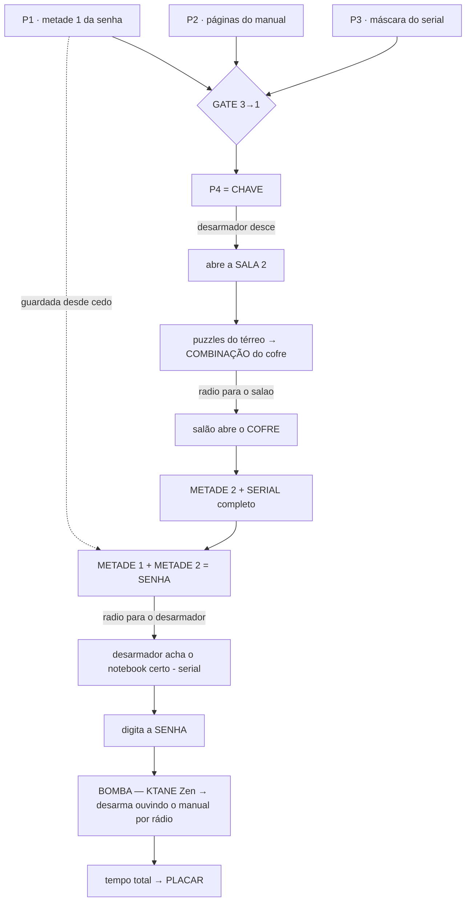
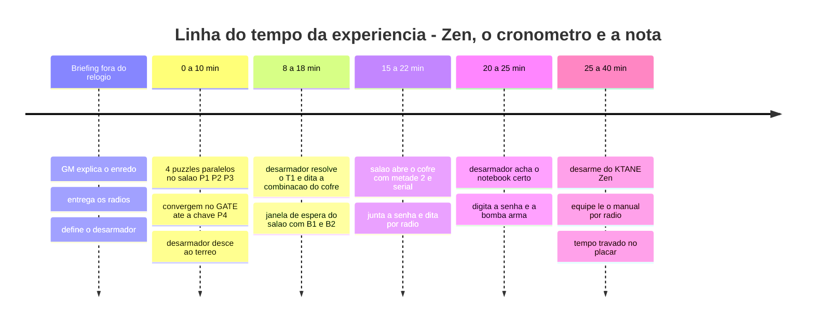
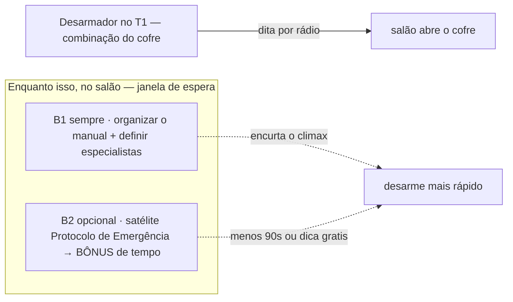

# 01 — Fluxo, mapa e papéis

## Mapa dos dois andares

```
╔═══════════════════════ 2º ANDAR ═══════════════════════╗
║  SALA 1 — SALÃO (grande) — EQUIPE DE 4                  ║
║                                                         ║
║   P1 ▸ METADE 1 da senha (achada CEDO, sem saber p/quê) ║
║   P2 ▸ páginas do MANUAL do KTANE (escondidas)          ║
║   P3 ▸ máscara parcial do SERIAL (ex.: SN-••7•)         ║
║        └─ P1+P2+P3 = GATE ─► P4                         ║
║   P4 ▸ CHAVE física da Sala 2                           ║
║                                                         ║
║   COFRE ▸ guarda METADE 2 da senha + SERIAL completo    ║
║           (combinação vem do TÉRREO, por rádio)         ║
║   TV ▸ cronômetro do jogo (Zen)   ·   RÁDIO #1          ║
╚═════════════════════════════════════════════════════════╝
                         │  chave desce com o desarmador
                         ▼
╔═══════════════════════ TÉRREO ═════════════════════════╗
║  SALA 2 — REUNIÃO (pequena, p/ 4) — DESARMADOR SOZINHO  ║
║                                                         ║
║   • 5–10 notebooks na mesa (só 1 é o certo; resto na    ║
║     tela de senha p/ despistar)                         ║
║   • Puzzles do térreo ▸ COMBINAÇÃO DO COFRE             ║
║     (desarmador dita por rádio p/ o salão)              ║
║   • Notebook certo é achado cruzando o SERIAL           ║
║   TV ▸ mesmo cronômetro do jogo   ·   RÁDIO #2          ║
╚═════════════════════════════════════════════════════════╝
```

## Grafo de dependências (a ordem é imposta pelo design)



> **Trilhas paralelas B1/B2** (não estão no caminho crítico acima) rodam no salão durante o
> T1 — ver diagrama na seção "Anti-ociosidade" mais abaixo.

> **Regras de sanidade do design (para não travar):**
> - **P4 (chave) NÃO depende do cofre nem da Sala 2** — só dos 3 gates do salão. Assim a
>   equipe sempre consegue abrir a Sala 2 sozinha.
> - **A combinação do cofre está SÓ na Sala 2** — obriga o desarmador a ser útil (não fica
>   só recebendo ordens).
> - **A METADE 1 é achada antes da chave** e parece inútil no momento — recompensa quem anota.

## Linha do tempo (alvo: 30–45 min de jogo; tempo Zen = pontuação)



Como é **Zen**, não há "estouro": o cronômetro é a **nota**. O GM usa dicas para evitar que
uma equipe fique travada tempo demais (ruim para o clima e para a fila do dia).

## Anti-ociosidade: as trilhas paralelas B1 e B2

**O problema:** enquanto o desarmador decifra a combinação do cofre no térreo (T1), os 4 do
salão poderiam ficar parados esperando o cofre abrir. Para evitar isso, existem duas trilhas
que **NÃO estão no caminho crítico** (não travam a chave, o cofre nem a senha):



- **B1 — Preparação do manual (sempre presente).** O P2 entrega as páginas embaralhadas;
  aqui os 4 **ordenam, destacam os 4 módulos e dividem quem cuida de qual**. Isso não trava
  nada e **encurta o clímax**, porque chegam no desarme já sabendo o manual.
- **B2 — Satélite opcional (bônus).** Um puzzle fora do caminho crítico cuja recompensa é
  **−90s no tempo final** (vantagem no placar) **ou** **1 dica grátis** no clímax — a equipe
  escolhe. Se ignorarem, **nada trava**. Detalhes e solução em `02-puzzles.md`.

> Por que **não** antecipar demais a chave: adiantar a chave só transfere a ociosidade
> (desarmador desce cedo e trabalha sozinho enquanto o salão espera). As trilhas B1/B2
> resolvem a janela sem criar um buraco novo e sem perder o momento de convergência do GATE.
> Mantenha a chave no ritmo do gate 3→1; só adiante se a equipe-teste do dia ainda ficar ociosa.

## Papéis (mantendo os 5 ativos)

**Salão (4 pessoas)** — sugerir, não impor:
| Papel | Faz |
|---|---|
| **Rádio-líder** | Fala com o desarmador; centraliza pedidos e respostas |
| **Puzzle A** | Toca P1 + parte do GATE |
| **Puzzle B** | Toca P2 (manual) + P3 (máscara serial) |
| **Escrivão/Manual** | Anota tudo (metade 1!) e, no clímax, vira leitor do manual do KTANE |

**Térreo (1 pessoa)** — o **desarmador**:
- Resolve os puzzles do térreo (combinação do cofre), acha o notebook certo, digita a senha
  e **desarma sozinho** ouvindo o manual pelo rádio. **Não** tem o manual em mãos.

### Divisão do manual no clímax
No salão, distribua o **manual** por módulo entre as 3–4 pessoas: "você é fios", "você é
botão", "você é Simon". O desarmador diz o módulo e as cores; o especialista responde. Isso
evita ociosidade e deixa a comunicação objetiva.

## Variantes rápidas
- **Mais fácil:** máscara do serial (P3) já mostra quase todo o serial; combinação do cofre
  com menos passos.
- **Mais difícil:** exija que a equipe **ordene** as páginas do manual (P2) antes de conseguir
  ler qualquer módulo no clímax.
