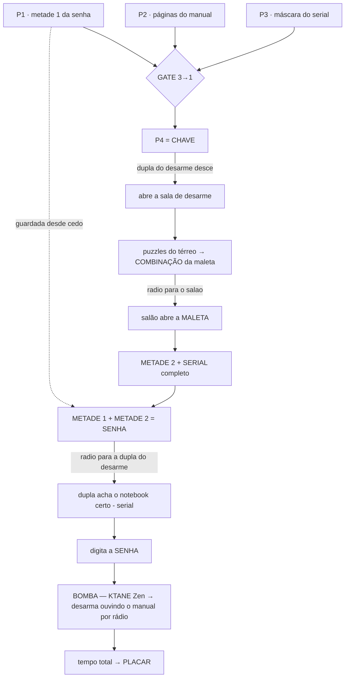
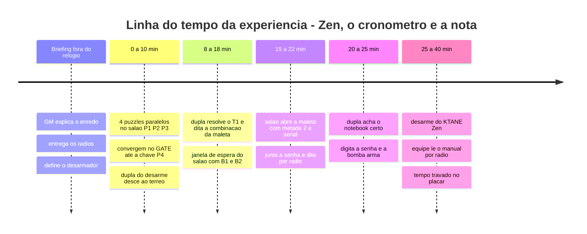
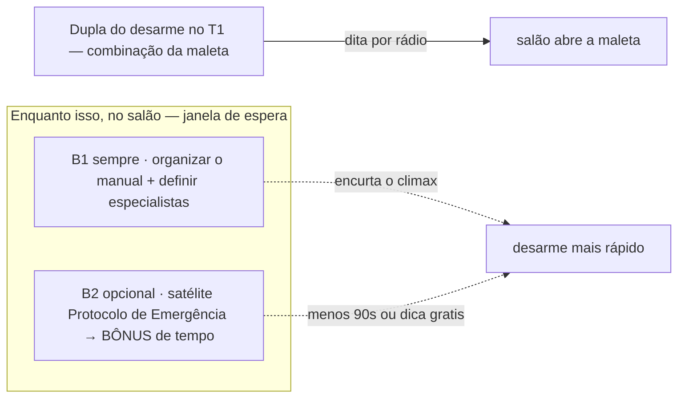

# 01 — Fluxo, mapa e papéis

## Mapa dos dois andares

> O mapa abaixo descreve **uma ala**. As duas alas (B e C) rodam o mesmo fluxo em paralelo.
> **Salão** = sala da equipe (1B / 1C) · **Sala de desarme** = sala do térreo (Calabouço /
> sala ao lado da sala do pastor). Mapeamento físico completo no steering `evento.md`.

```
╔═══════════════════════ 2º ANDAR ═══════════════════════╗
║  SALÃO (grande) — EQUIPE DE 4                           ║
║                                                         ║
║   P1 ▸ METADE 1 da senha (achada CEDO, sem saber p/quê) ║
║   P2 ▸ páginas do MANUAL do KTANE (escondidas)          ║
║   P3 ▸ máscara parcial do SERIAL (ex.: SN-••7•)         ║
║        └─ P1+P2+P3 = GATE ─► P4                         ║
║   P4 ▸ CHAVE física da sala de desarme                  ║
║                                                         ║
║   MALETA ▸ guarda METADE 2 da senha + SERIAL completo   ║
║            (combinação vem do TÉRREO, por rádio)        ║
║   TV ▸ cronômetro do jogo (Zen)   ·   RÁDIO #1          ║
╚═════════════════════════════════════════════════════════╝
                         │  chave desce com a dupla do desarme
                         ▼
╔═══════════════════════ TÉRREO ═════════════════════════╗
║  SALA DE DESARME (pequena) — DESARMADOR + AJUDANTE      ║
║                                                         ║
║   • 5–10 notebooks na mesa (só 1 é o certo; resto na    ║
║     tela de senha p/ despistar)                         ║
║   • Puzzles do térreo ▸ COMBINAÇÃO DA MALETA            ║
║     (a dupla dita por rádio p/ o salão)                 ║
║   • Notebook certo é achado cruzando o SERIAL           ║
║   TV ▸ mesmo cronômetro do jogo   ·   RÁDIO #2          ║
╚═════════════════════════════════════════════════════════╝
```

## Grafo de dependências (a ordem é imposta pelo design)


```mermaid
flowchart TD
    P1["P1 · metade 1 da senha"] --> GATE{"GATE 3→1"}
    P2["P2 · páginas do manual"] --> GATE
    P3["P3 · máscara do serial"] --> GATE
    GATE --> KEY["P4 = CHAVE"]
    KEY -->|dupla do desarme desce| SALA2["abre a sala de desarme"]
    SALA2 --> T1["puzzles do térreo → COMBINAÇÃO da maleta"]
    T1 -->|radio para o salao| MALETA["salão abre a MALETA"]
    MALETA --> M2["METADE 2 + SERIAL completo"]
    P1 -.->|guardada desde cedo| SENHA["METADE 1 + METADE 2 = SENHA"]
    M2 --> SENHA
    SENHA -->|radio para a dupla do desarme| ACHA["dupla acha o notebook certo - serial"]
    ACHA --> DIGITA["digita a SENHA"]
    DIGITA --> BOMBA["BOMBA — KTANE Zen → desarma ouvindo o manual por rádio"]
    BOMBA --> PLACAR["tempo total → PLACAR"]
```

> **Trilhas paralelas B1/B2** (não estão no caminho crítico acima) rodam no salão durante o
> T1 — ver diagrama na seção "Anti-ociosidade" mais abaixo.

> **Regras de sanidade do design (para não travar):**
> - **P4 (chave) NÃO depende da maleta nem da sala de desarme** — só dos 3 gates do salão. Assim
>   a equipe sempre consegue abrir a sala de desarme sozinha.
> - **A combinação da maleta está SÓ na sala de desarme** — obriga a dupla do térreo a ser útil
>   (não fica só recebendo ordens).
> - **A METADE 1 é achada antes da chave** e parece inútil no momento — recompensa quem anota.
> - **As pistas da combinação do COFRE são red herring de propósito** — pertencem ao meta-jogo
>   da Premiação 2 (fim do dia) e **NÃO estão no caminho crítico**: não travam a chave, a maleta,
>   a senha nem o desarme. A sala é 100% resolvível sem tocá-las. Ver `07-meta-jogo-cofre.md`.
>   (O **cofre** do meta-jogo é peça separada da **maleta de evidências** do fluxo da bomba.)

## Linha do tempo (alvo: 30–45 min de jogo; tempo Zen = pontuação)


```mermaid
timeline
    title Linha do tempo da experiencia - Zen, o cronometro e a nota
    Briefing fora do relogio : GM explica o enredo : entrega os radios : define o desarmador
    0 a 10 min : 4 puzzles paralelos no salao P1 P2 P3 : convergem no GATE ate a chave P4 : dupla do desarme desce ao terreo
    8 a 18 min : dupla resolve o T1 e dita a combinacao da maleta : janela de espera do salao com B1 e B2
    15 a 22 min : salao abre a maleta com metade 2 e serial : junta a senha e dita por radio
    20 a 25 min : dupla acha o notebook certo : digita a senha e a bomba arma
    25 a 40 min : desarme do KTANE Zen : equipe le o manual por radio : tempo travado no placar
```

Como é **Zen**, não há "estouro": o cronômetro é a **nota**. O GM usa dicas para evitar que
uma equipe fique travada tempo demais (ruim para o clima e para a fila do dia).

> **Atenção à janela do evento:** o slot é de **30 min de jogo + 10 min de reset**. A linha do
> tempo acima (até ~40 min) é o alvo "folgado" de design; no dia, calibre as dicas para que o
> desarme aconteça por volta dos **~28–30 min** e o ciclo não atropele o próximo horário
> agendado. Ver escala e dicas no `04-roteiro-game-master.md`.

## Anti-ociosidade: as trilhas paralelas B1 e B2

**O problema:** enquanto a dupla do térreo decifra a combinação da maleta (T1), os 4 do
salão poderiam ficar parados esperando a maleta abrir. Para evitar isso, existem duas trilhas
que **NÃO estão no caminho crítico** (não travam a chave, a maleta nem a senha):


```mermaid
flowchart LR
    T1["Dupla do desarme no T1 — combinação da maleta"] -->|dita por rádio| MALETA["salão abre a maleta"]
    subgraph JANELA["Enquanto isso, no salão — janela de espera"]
        B1["B1 sempre · organizar o manual + definir especialistas"]
        B2["B2 opcional · satélite Protocolo de Emergência → BÔNUS de tempo"]
    end
    B1 -.->|encurta o climax| CLIMAX["desarme mais rápido"]
    B2 -.->|menos 90s ou dica gratis| CLIMAX
```

- **B1 — Preparação do manual (sempre presente).** O P2 entrega as páginas embaralhadas;
  aqui os 4 **ordenam, destacam os 4 módulos e dividem quem cuida de qual**. Isso não trava
  nada e **encurta o clímax**, porque chegam no desarme já sabendo o manual.
- **B2 — Satélite opcional (bônus).** Um puzzle fora do caminho crítico cuja recompensa é
  **−90s no tempo final** (vantagem no placar) **ou** **1 dica grátis** no clímax — a equipe
  escolhe. Se ignorarem, **nada trava**. Detalhes e solução em `02-puzzles.md`.

> Por que **não** antecipar demais a chave: adiantar a chave só transfere a ociosidade
> (a dupla desce cedo e trabalha enquanto o salão espera). As trilhas B1/B2
> resolvem a janela sem criar um buraco novo e sem perder o momento de convergência do GATE.
> Mantenha a chave no ritmo do gate 3→1; só adiante se a equipe-teste do dia ainda ficar ociosa.

## Papéis (mantendo os 6 ativos)

**Salão (4 pessoas)** — sugerir, não impor:
| Papel               | Faz                                                                 |
| ------------------- | ------------------------------------------------------------------- |
| **Rádio-líder**     | Fala com a dupla do desarme; centraliza pedidos e respostas         |
| **Puzzle A**        | Toca P1 + parte do GATE                                             |
| **Puzzle B**        | Toca P2 (manual) + P3 (máscara serial)                              |
| **Escrivão/Manual** | Anota tudo (metade 1!) e, no clímax, vira leitor do manual do KTANE |

**Sala de desarme (2 pessoas)** — a **dupla do térreo**:
| Papel          | Faz                                                                                                                                                         |
| -------------- | ----------------------------------------------------------------------------------------------------------------------------------------------------------- |
| **Desarmador** | Opera **o notebook/bomba**: digita a senha e, no clímax, executa o desarme ouvindo o manual pelo rádio. **Não** tem o manual em mãos; só ele mexe na bomba. |
| **Ajudante**   | Resolve o **T1** (combinação da maleta), lê as **etiquetas** dos notebooks, **cruza o serial** para achar o `SN-4270` e **opera o rádio** com o salão.      |

> **Por que 2 e não 1:** com o ajudante cuidando de T1/serial/rádio, o desarmador foca na
> bomba no clímax. Divide a carga sem quebrar a dependência por rádio — a dupla ainda **precisa**
> do salão para a senha, e o salão **precisa** da dupla para a combinação da maleta. **Não** dê o
> manual à dupla: a ponte de rádio com o salão é o coração da experiência.
>
> *(A combinação de que a dupla precisa é a da **maleta de evidências** no salão — a mala que
> substituiu o cofre no fluxo da sala. O cofre em si vira o meta-jogo da Premiação 2. Ver
> `02-puzzles.md` e `07-meta-jogo-cofre.md`.)*

### Divisão do manual no clímax
No salão, distribua o **manual** por módulo entre as 4 pessoas: "você é fios", "você é
botão", "você é símbolos", "você é Simon". O desarmador diz o módulo e as cores; o especialista
responde. Isso evita ociosidade e deixa a comunicação objetiva.

## Variantes rápidas
- **Mais fácil:** máscara do serial (P3) já mostra quase todo o serial; combinação da maleta
  com menos passos.
- **Mais difícil:** exija que a equipe **ordene** as páginas do manual (P2) antes de conseguir
  ler qualquer módulo no clímax.
